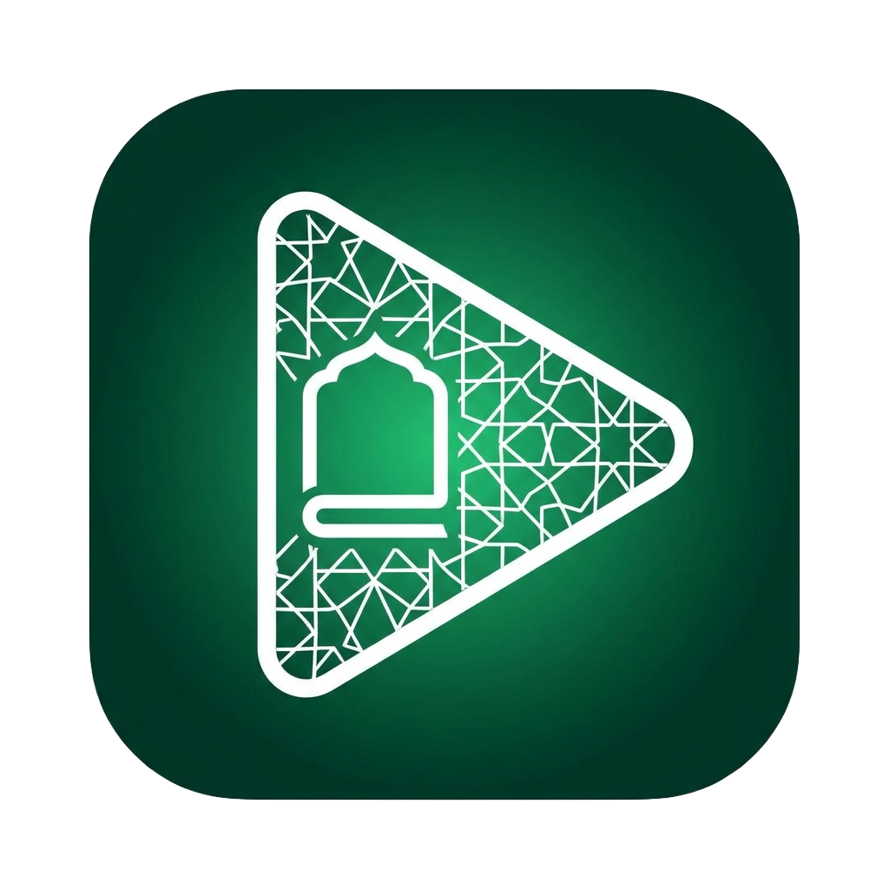

<div align="center">



# 🎬 QuranReels

### Transform Quran recitations into cinematic vertical videos — ready to share.

<p>
  <a href="#-features">
    
  </a>
  <a href="#-screenshots">
    
  </a>
  <a href="#-architecture">
    
  </a>
  <a href="#-tech-stack">
    
  </a>
  <a href="#-contact">
    
  </a>
</p>

<br>

<p>
  
  
  
  
  
</p>

<br>

<p>
  <strong>📖 Quran Selection</strong>
  &nbsp;•&nbsp;
  <strong>🎙️ Reciter Selection</strong>
  &nbsp;•&nbsp;
  <strong>🎨 Custom Templates</strong>
  &nbsp;•&nbsp;
  <strong>🎥 FFmpeg Video Generation</strong>
</p>

</div>

---

## What is QuranReels?

QuranReels is a Flutter application that lets users pick any Surah and Ayah range, choose from world-renowned reciters, select a visual template, and export a professional 9:16 vertical video — fully on-device, no backend required.

Built to solve a real problem: creating Quran recitation videos for social media is technically complex. QuranReels handles audio synchronization, Arabic text rendering, gradient backgrounds, and FFmpeg composition in a clean, guided flow.

## 📱 User Flow
```
Surah  →  Ayah Range  →  Reciter  →  Template  →  Preview  →  Generate  →  Share
```

---
## ✨ Features

| | Feature | Details |
|---|---|---|
| 📖 | **Surah & Ayah Selection** | Search all 114 Surahs, select any Ayah range with live text preview |
| 🎙️ | **12 World Reciters** | Abdul Basit, Al-Afasy, As-Sudais, Al-Minshawi & more |
| 🔊 | **Audio Preview** | Preview recitation before generating |
| 🎨 | **8 Built-in Templates** | Gradient backgrounds (Emerald, Ocean, Sunset, Minimal...) |
| 🖼️ | **Custom Templates** | Upload your own background image |
| 🎬 | **On-Device Video Generation** | FFmpeg-powered, no internet needed after audio download |
| 📝 | **Synchronized Subtitles** | Each Ayah appears exactly when the reciter reads it |
| 💾 | **Save & Share** | Export to gallery or share directly to Instagram, WhatsApp, TikTok |
| 🌍 | **Arabic + English** | Full RTL support with localized UI |
| 🌓 | **Dark / Light Theme** | Persistent theme preference |

---

## 📸 Screenshots

### Surah & Ayah Selection
<div align="center">
  
  &nbsp;&nbsp;
  
</div>

### Reciter & Template
<div align="center">
  
  &nbsp;&nbsp;
  
</div>

### Preview & Result
<div align="center">
  
  &nbsp;&nbsp;
  
</div>

---


## 🏗 Architecture

Feature-based folder structure with MVVM-oriented separation and Cubit/BLoC state management.

```
lib/
├── core/                    # Shared infrastructure
│   ├── services/            # VideoGeneratorService, QuranAudioService
│   ├── routing/             # Named routes
│   ├── theme/               # AppColors, AppTheme, AppTextStyles
│   └── shared_widgets/      # CustomAppBar, CustomButton, CustomCard...
│
└── features/
    ├── home/
    ├── quran_generator/
    │   ├── data/            # Models, repositories
    │   └── presentation/
    │       ├── cubits/      # VideoGenerationCubit, PreviewCubit, AudioCubit
    │       ├── controllers/ # VideoResultController
    │       ├── screens/     # 7 screens
    │       └── widgets/     # Extracted, reusable widgets
    ├── onboarding/
    └── settings/
```

**Patterns:** Repository, Cubit/BLoC, Service Layer, Dependency Injection (GetIt)

---

## 🎬 Video Generation Pipeline

All processing happens on-device using `ffmpeg_kit_flutter`.

```
Download Ayah audio files  →  Extract per-file duration (ffprobe)
         ↓
Merge audio (concat)  →  Dart-side Arabic word wrap
         ↓
Compose: gradient background + timed subtitle filters + metadata overlay
         ↓
Export MP4  (720×1280 · H.264 · AAC · faststart)
```

**Key engineering decisions:**
- **720p output** — 2× faster than 1080p with no visible quality loss on mobile
- **Dart-side word wrap** — avoids FFmpeg multiline limitations for Arabic text
- **`enable='between(t,start,end)'`** — each Ayah subtitle synced to exact audio duration
- **Shadow rendering** — cleaner text on any background, no border artifacts
- **`superfast` preset + CRF 28** — optimal speed/quality balance on mobile hardware

---

## 🛠 Tech Stack

| Category | Package |
|---|---|
| Framework | Flutter 3.x, Dart 3.x |
| State Management | `flutter_bloc` (Cubit) |
| Dependency Injection | `get_it` |
| Video Processing | `ffmpeg_kit_flutter_new` |
| Audio Playback | `just_audio` |
| Video Playback | `video_player` |
| Quran Data | AlQuran Cloud API + Hive cache |
| Quran Audio | EveryAyah.com |
| Localization | `easy_localization` |
| Responsive UI | `flutter_screenutil` |
| Gallery / Share | `gal`, `share_plus` |
| Networking | `http`, `dio` |
| Local Storage | `hive`, `shared_preferences` |

---

## ⚙️ Engineering Highlights

### 🏗 Architecture & State Management

- **Feature-based architecture** with clear separation between features and shared application infrastructure
- **MVVM-oriented separation** between UI, state management, and application logic
- **Cubit / BLoC** for predictable and reactive state management
- Reusable and modular **custom widgets**
- Centralized **theme and color system**
- Centralized **typography and text styles**
- Separation of media processing logic into dedicated services

### 🎥 Media Processing

- Dynamic **Quran Ayah audio URL generation** using EveryAyah
- On-demand **Ayah audio downloading** instead of bundling complete recitations
- **Audio concatenation** for combining selected Ayahs into a continuous track
- **FFmpeg-based video composition**
- Arabic **Quran text rendering**
- Dynamic Surah and reciter information rendering
- **9:16 vertical video generation** for social media content
- Temporary file management for generated audio and video
- Video progress tracking during generation

### 🎨 UI & User Experience

- Responsive layouts using **Flutter ScreenUtil**
- Light / Dark theme support
- Arabic / English localization with **RTL support**
- Guided multi-step Quran Reel creation flow
- Reusable custom UI components
- Audio preview before video generation
- Suggested and personal template management
- Template rename and delete functionality
- Clear loading, success, and failure states
- Video preview with playback controls
- Save generated videos to the device gallery
- Share generated videos directly from the application
## 🗺️ Roadmap

### ✅ Implemented

- [x] Surah selection
- [x] Ayah range selection
- [x] Reciter selection
- [x] Reciter audio preview
- [x] Suggested templates
- [x] My Templates
- [x] Template selection
- [x] Template rename / delete
- [x] Preview screen
- [x] Video generation screen
- [x] Video result screen
- [x] Video playback
- [x] Save to gallery
- [x] Share generated video
- [x] Arabic / English localization
- [x] Light / Dark theme
- [x] Responsive UI
- [x] FFmpeg generation foundation

### 🚧 In Progress

- [ ] Finalize FFmpeg generation pipeline
- [ ] Accurate Ayah / audio synchronization
- [ ] Improve Arabic text wrapping
- [ ] Optimize generation speed & memory usage
- [ ] Improve generated video quality
- [ ] Finalize custom template persistence
- [ ] Production testing across Android devices

### 🔮 Planned

- [ ] More Quran templates
- [ ] More reciters
- [ ] Custom backgrounds
- [ ] Text animation styles
- [ ] Multiple video resolutions
- [ ] Generation history
- [ ] Favorites / saved projects
- [ ] Google Play release

---

## 🚀 Getting Started

```bash
git clone https://github.com/KarimTamer74/quran_reels.git
cd quran_reels
flutter pub get
flutter run
```

> Requires Android SDK 21+ · FFmpeg Kit is bundled — no additional setup needed.

---

## 👨‍💻 Contact

**Karim Tamer** — Flutter Developer

[](https://github.com/KarimTamer74)
[](https://www.linkedin.com/in/karim-tamer74)

---

## 📄 License

Portfolio and demonstration purposes.